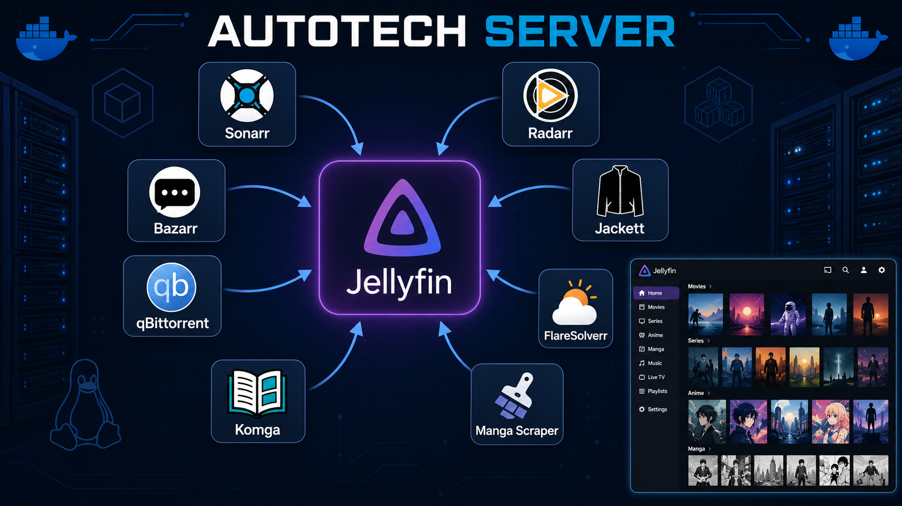
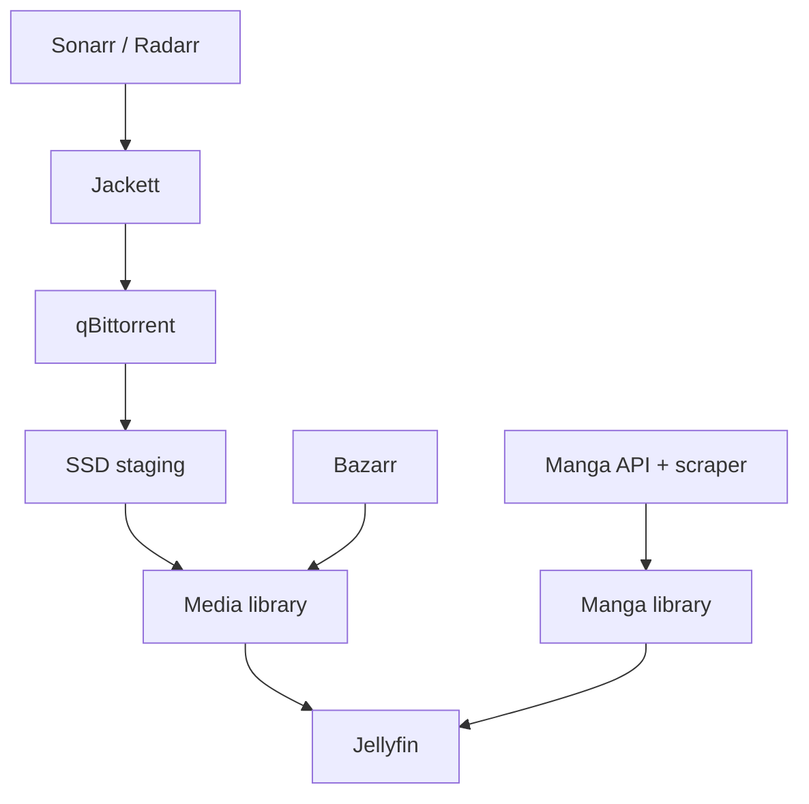

# Autotech Server

Automated deployment platform for a self-hosted Linux media server.

Autotech Server combines containerized media services, automated content organization, subtitle management, custom Jellyfin branding, and a manga ingestion pipeline in one reproducible architecture. The project began as a home-server deployment and evolved into a Linux-first installation platform with an experimental Windows/WSL2 bootstrapper.

> This repository is a sanitized portfolio edition. Production configuration, credentials, customer data, licensing infrastructure, and the complete commercial installer are intentionally excluded.



## Architecture



The download clients use fast SSD staging directories, while imported and organized media is stored in the final library. Jellyfin reads only the organized library, and Bazarr manages subtitles after import. A separate Python service handles manga discovery, chapter packaging, cover generation, and library refreshes.

## Core services

| Service | Role | Default port |
| --- | --- | ---: |
| Jellyfin | Media server and customized user interface | `8096` |
| Sonarr | Series and anime library automation | `8989` |
| Radarr | Movie library automation | `7878` |
| Jackett | Indexer integration layer | `9117` |
| qBittorrent | Download client and SSD staging | `8080` |
| Bazarr | Automated subtitle management | `6767` |
| FlareSolverr | Compatibility layer for supported sources | `8191` |
| Manga API | Local management API for manga workflows | `5555` |

## Highlights

- Docker Compose deployment on Ubuntu Server
- Repeatable media, cache, and service directory layout
- Automated Sonarr/Radarr to qBittorrent import pipeline
- SSD staging with final media storage separated from downloads
- Jellyfin branding and custom interface extensions
- Python manga workflow with multiple provider adapters
- CBZ chapter generation, cover artwork, and metadata management
- `systemd` services for local APIs and scheduled updates
- Experimental PowerShell bootstrapper for WSL2 environments

## Repository contents

```text
autotech-server/
├── docs/
│   ├── architecture.md
│   └── security-review.md
├── examples/
│   ├── .env.example
│   └── docker-compose.example.yml
├── assets/
│   └── autotech-logo.svg
├── .gitignore
├── LICENSE
└── README.md
```

The files under `examples/` document the public architecture without exposing production defaults or the private deployment logic.

## Quick start (architecture demo)

This public example is intended for study and local experimentation, not as the production installer.

```bash
cp examples/.env.example .env
docker compose --env-file .env -f examples/docker-compose.example.yml config
docker compose --env-file .env -f examples/docker-compose.example.yml up -d
```

Create the host directories referenced in `.env` before starting the stack. Each service still requires its normal first-run configuration.

## Security model

- Secrets are supplied through environment variables or secret files.
- Real service databases and configuration directories are never committed.
- The local management API should not be exposed directly to the internet.
- Destructive installation operations require explicit confirmation in production tooling.
- Credentials found during the public-review process were removed from this edition and must be rotated in the private environment.

See [the security review](docs/security-review.md) for the publication checklist.

## Status

The Linux media pipeline has been validated end to end. The Windows/WSL2 path remains an experimental prototype, and the public repository intentionally contains only a demonstrative Compose configuration.

## Author

Developed by **Lucas Patrocínio**, Electronic Engineering student at the Federal University of Santa Catarina (UFSC).

## License

The sanitized examples and documentation in this repository are available under the [MIT License](LICENSE). Third-party services and images retain their respective licenses.
